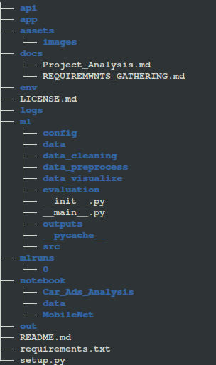

# AITraining-Project1

AI training projects for 10 days.

## Project Structure Overview
  

## Installing requirements.txt file 

First install the requirements.txt file:

`pip install -r requirements.txt`

## DOCUMENTS

### REQUIREMENT_GATHERING
  The link to the above file is [here](./docs/REQUIREMWNTS_GATHERING.md).

### PROJECT_ANALYSIS
  The link to the above file is [here](./docs/Project_Analysis.md).

## EDA(CAR ADS DATA)
 The link to the EDA analysis file is [here](./notebook/Car_Ads_Analysis/bg_car_ads_data_analysis.ipynb).

## Emotion detection and recognition

  ### Execution code
  Either of the following methods, you can use to run the app:

  1. `python -m app.ISEAR_app.ISEAR` 

      or

      `export FLASK_APP='app/ISEAR_app/ISEAR.py'
      
      `flask run`
      

  Note: be in file AITraining-Project1 folder

  2. `python -m ISEAR_app.ISEAR`  
      
      or
      
      `export FLASK_APP='ISEAR_app/ISEAR.py'
      
      `flask run`
      
  Note: be in app folder

  ### docker execution

  #### BUILD Dockerfile
  `docker-compose build`

  #### RUN build docker file
  `docker-compose up`

## Ballot paper clasification

  The link for Ballor paper classification is [here](./notebook/Ballot_Paper_Classification/MobileNet/bg_ballot_paper_Mobilenet.ipynb).

  
